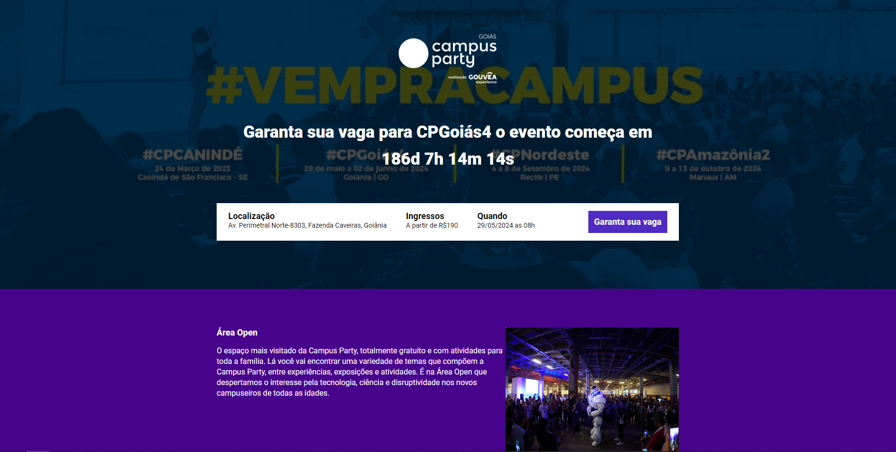

## 📅 Data evento

<h1>
    
</h1>

 

## 📎 Sumario
- 📕 Sobre
- 🛠️ Executando projeto
- ⚙ Tecnologias Utilizadas
- 🙍‍♂️ Autor

 

## 📕 Sobre

Este projeto é uma landing page de um evento ficticio, permitindo que o usuario consiga ver em tempo real quanto tempo falta para o evento. Para o desenvolvimento dessa pagina foi utilizado sass, bibliotecas js para animação dos elementos, entre outras ferramentas.

 

## 🛠️ Executando projeto

- Instale as dependências do projeto executando ``npm install`` no diretório do projeto.
- Execute o comando ``npm run dev`` para iniciar um servidor de desenvolvimento local e gerar a build de desenvolvimento.

 

## ⚙ Tecnologias Utilizadas

 

## 🙍‍♂️ Autor

| [ John Robert](https://github.com/jrcmelo) |
| :---: |

 

